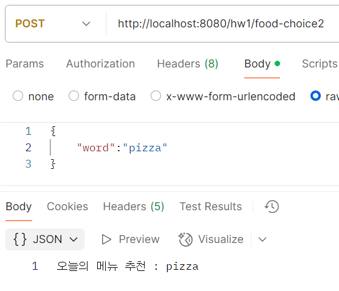

# 나만의 컨트롤러 만들기

이 프로젝트는 Spring Boot를 사용하여 다양한 HTTP 메서드를 처리하는 나만의 컨트롤러를 만드는 예제입니다. `@RestController`와 `@RequestMapping`, `@GetMapping`, `@PostMapping`, `@PatchMapping` 어노테이션을 활용하여 RESTful API를 구현합니다. 각 메서드는 클라이언트로부터 데이터를 받아서 그에 맞는 응답을 반환합니다.

## 프로젝트 구조

- `hw1` 컨트롤러: 다양한 HTTP 메서드를 처리하는 API 엔드포인트들로 구성됩니다.
- `hw1_1` 클래스: `POST` 요청에서 JSON 데이터를 자바 객체로 매핑하여 처리합니다.

## 코드 설명

### 1. **`@GetMapping("/{word}")`**

- **URL**: `/hw1/{word}`
- **HTTP Method**: GET
- **설명**: 클라이언트가 `GET` 요청을 보내면, URL에 포함된 `word` 값을 받아서 `저녁 메뉴 추천 : {word}` 형식으로 반환합니다.
- **예시**:
    - `GET /hw1/pasta` → `저녁 메뉴 추천 : pasta`

---

### 2. **`@PostMapping("/food-choice")`**

- **URL**: `/hw1/food-choice`
- **HTTP Method**: POST
- **설명**: 클라이언트가 JSON 데이터를 `POST`로 전송하면, 받은 데이터를 그대로 문자열로 반환합니다. 이 경우 `@RequestBody String word`를 사용하여 JSON 데이터를 문자열로 처리합니다.
- **예시**:
    - 클라이언트가 `"pizza"` 형태의 데이터를 전송하면,
        - 응답: `오늘의 메뉴 추천 : pizza`

---

### 3. **`@PostMapping("/food-choice2")`**

- **URL**: `/hw1/food-choice2`
- **HTTP Method**: POST
- **설명**: 클라이언트가 JSON 데이터를 `POST`로 전송하면, `hw1_1` 클래스의 객체로 매핑하여 `word` 값을 반환합니다. 이 예시에서는 JSON 데이터를 `hw1_1` 객체로 처리합니다.
- **예시**:
    - 클라이언트가 `{"word": "pizza"}` 형태의 데이터를 전송하면,
        - 응답: `오늘의 메뉴 추천 : pizza`
    
    

---

### 4. **`@PatchMapping("/food-change")`**

- **URL**: `/hw1/food-change/{word}`
- **HTTP Method**: PATCH
- **설명**: 클라이언트가 `PATCH` 요청을 보내면, URL에 포함된 `word` 값을 받아서, 특정 조건에 맞는 메뉴 이름을 반환합니다. 예를 들어, `word`가 "pizza"일 때만 메뉴 이름을 변경합니다.
- **예시**:
    - `PATCH /hw1/food-change/pizza` → `patch food name : pizza`
    - `PATCH /hw1/food-change/burger` → `no change`
---

## 사용된 주요 어노테이션

- **@GetMapping**: GET 요청을 처리하는 메서드
- **@PostMapping**: POST 요청을 처리하는 메서드
- **@PatchMapping**: PATCH 요청을 처리하는 메서드
- **@RequestBody**: 요청 본문을 객체로 변환하여 매핑하는 어노테이션
- **@PathVariable**: URL 경로에서 값을 추출하여 메서드 파라미터에 매핑하는 어노테이션

---

## 상대방 컨트롤러에 접속하는 법

#### 힌트를 통해 알게됨
- **상대방의 서버에 접속하려면 해당 서버의 IP 주소를 알아야 합니다**
- 원격 서버(상대방의 서버)의 IP 주소 찾는 방법으로는 서버 관리자에게 문의하거나, 직접 서버에서 확인하는 방법이 있고
- 로컬 네트워크에서 내 컴퓨터(내 서버)의 IP 주소 찾는 법은 ``ipconfig``명령어를 통해 알 수 있다고 합니다(윈도우)
