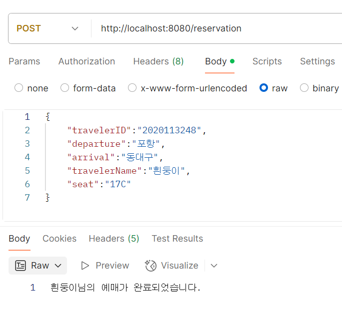
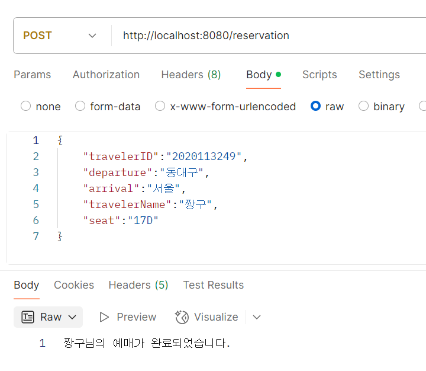
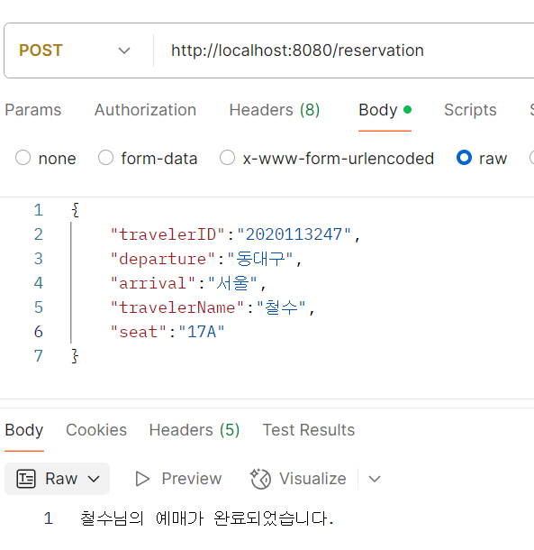
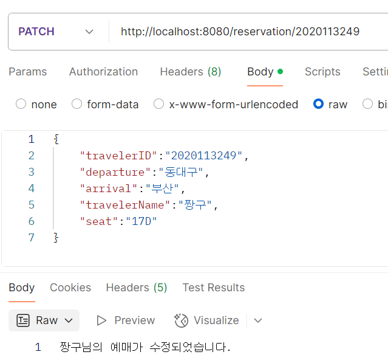
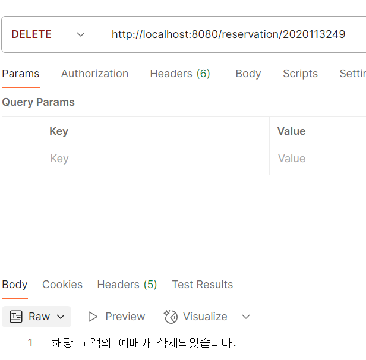
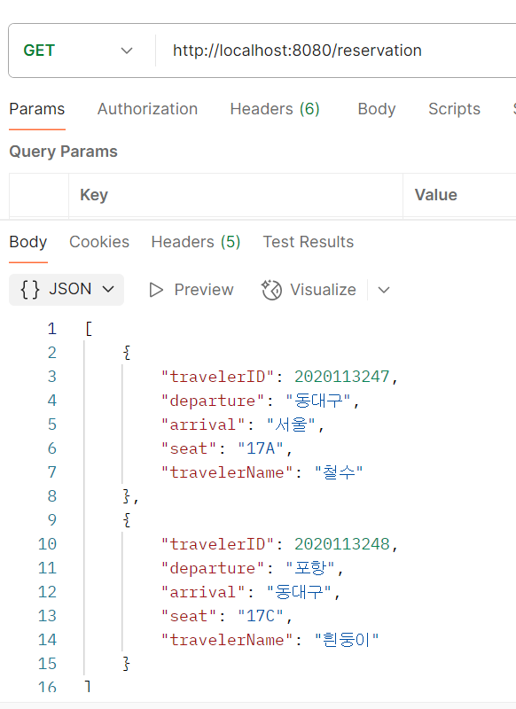

## 나만의 CRUD 만들기
___

### 흰둥이는 대구 여행을 계획 중이에요~

### 무사히 포항에서 대구로 출발하는 기차를 예매했어요~

### 어라, 짱구는 흰둥이로 같이 여행 안하고 혼자 서울로 가버리네요?

### 철수랑 같이 하는 여행이였군요~ 둘의 우정이 돈독하네요

### 어라라, 짱구가 갑자기 부산으로 목적지를 바꾸네요?

### 아니? 갑자기 여행을 취소해버렸네요? 역시 데빌구에요

### 이렇게 여행은 철수랑 흰둥이만 떠나게 되었어요
### 흰둥이는 똑똑하니까 혼자서도 여행을 잘할거에요~
___
## 고민해야될 점

* dto의 분리가 필요해보임 (해당 dto를 서비스, 리포지터리, 컨트롤러 전부 사용해서 계층 분리를 흐리게 만들 수 있음)
* dto와 entity를 분리하지 않고 사용했기 때문에 entity는 디비와 연관되도록 분리해서 사용해야 될 거같음
* 서비스 로직이 단순화 되어있고 리포지터리에 코드가 집중되어있어서 dto와 entity의 사용 분리를 통해 서비스 로직을 단단히 해야될 필요성을 느낌