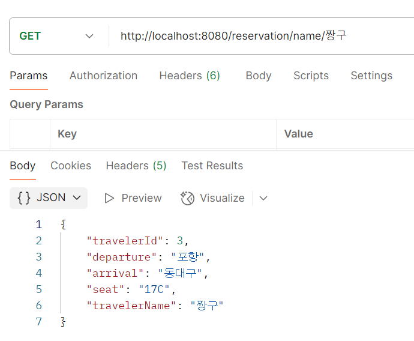

## 나만의 CRUD만들기 2탄

### 짱구랑 흰둥이가 같이 여행을 떠나요~

### 흰둥이가 먼저 대구로 향하는 기차를 예매했어요

### 짱구는 슬쩍 흰둥이 티켓을 보더니 의미심장하게 티켓을 예매했어요~

### 흰둥이는 어딘가 찝찝한 기분이 들었어요

### 짱구 이름으로 확인을 해보니 자기랑 같은 자리에 예매한걸 알게되었어요

### 예매 시스템이 엉망인거에 화난 흰둥이는 민원을 넣었고 결국 해결해냈답니다~

## 생각해볼 점
- request dto와 service dto를 분리하면 좋을거같음
- 어노테이션을 더 알아두면 좋을거같음, 특히 데이터를 읽고 쓰는데 있어 트랜잭션 관련해서 실무적으로 많이 쓰이고 있기에 다음에 적용해볼 계획임