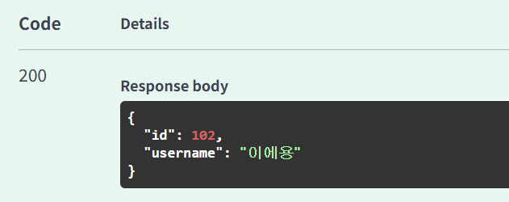
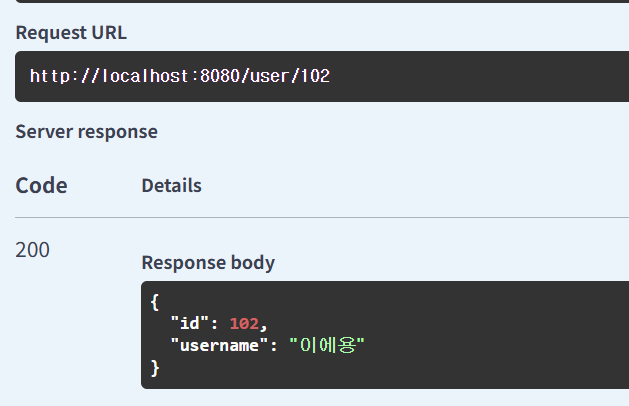
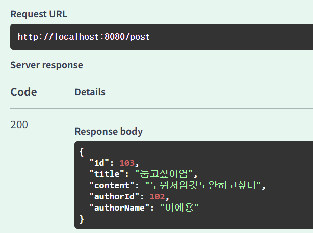
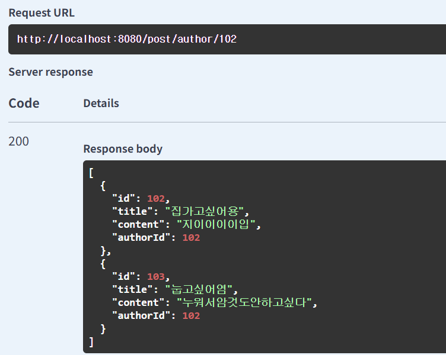

## 블로그 플랫폼 만들기

#### post /user 로 우선 작가(유저)를 등록

#### 작가 id로 작가 정보 불러오기

#### 게시글 등록 하기(author랑 user는 같은 것-mapped by)

#### 작가 id로 검색하면 작가가 쓴 게시글 전부 불러옴

### 고려할점
- onetomany와 manytoone 사용시 unique제한 혹은 FetchType설정 고려해야됨
- builder를 주로 사용했었는데 entity에 builder어노테이션 붙은게 어색한거 같음 차라리 of메서드 사용하는게 깔끔할거같다는 생각이들어서 나중에 수정해야할거같음
- 시간상 좋아요 기능은 반영못했는데 좋아요 기능을 구성할때 entity에 unique제한이 들어가야할거같음
- 추후 id 혹은 유사 기능을 통해 정렬을 하거나 이럴때 락도 고려해야될거같음