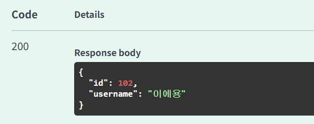
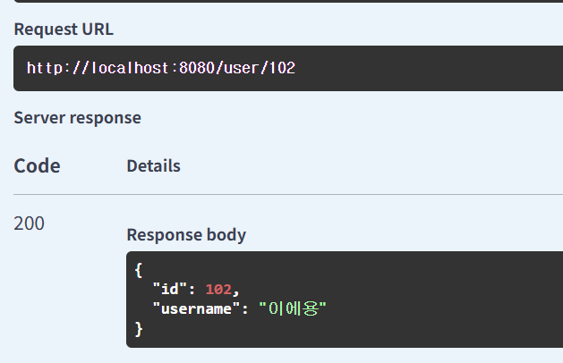
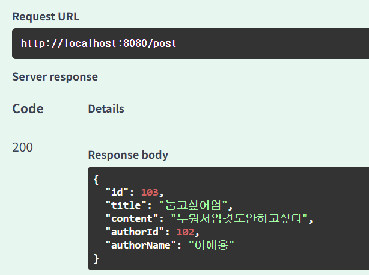
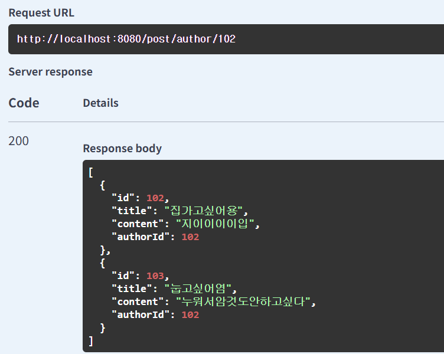
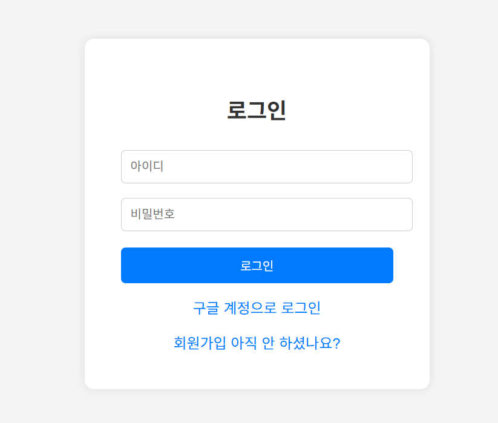
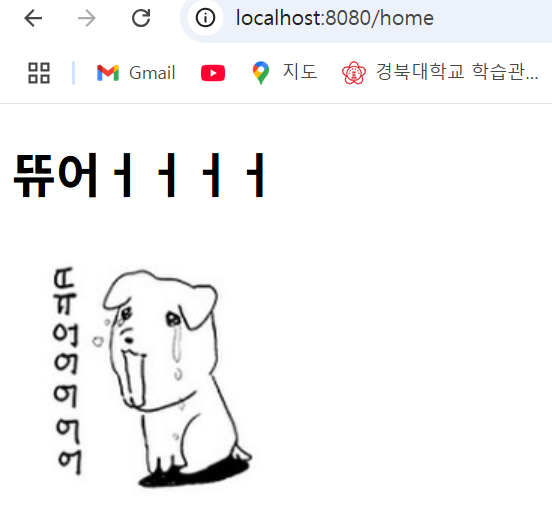
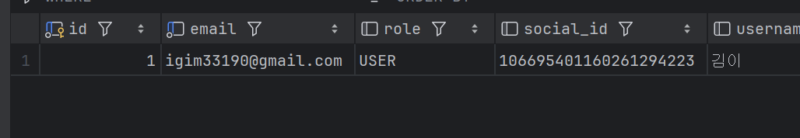

## 블로그 플랫폼에 구글 로그인 추가하기

#### post /user 로 우선 작가(유저)를 등록

#### 작가 id로 작가 정보 불러오기

#### 게시글 등록 하기(author랑 user는 같은 것-mapped by)

#### 작가 id로 검색하면 작가가 쓴 게시글 전부 불러옴
### 위 기능들은 문제없이 돌아감

----
### 구글 로그인 추가

#### 지피티한테 깔쌈하게 해달라고 하니까 이렇게 만들어줌 개굳

#### 지금 내 심정^^인생이 쉽지않음ㄹㅇ 아 올해 뱀띠 대박난다던데 구란가;

#### 아 디비에 정보 잘들어감 볼때마다 구글아이디 거슬림 자동으로 만들어준거 걍 쓴건데 내 이름 영문 저거 아인데;

#### 이제 로그인 성공하면 home 저 갱얼쥐 듀어ㅓㅓ 하는거 보이는데 블로그 기능 연동하려면 로그인한 당사자가 유저가 되도록 구성하면서 웹페이지 프론트엔드 구성하면 될거같음
